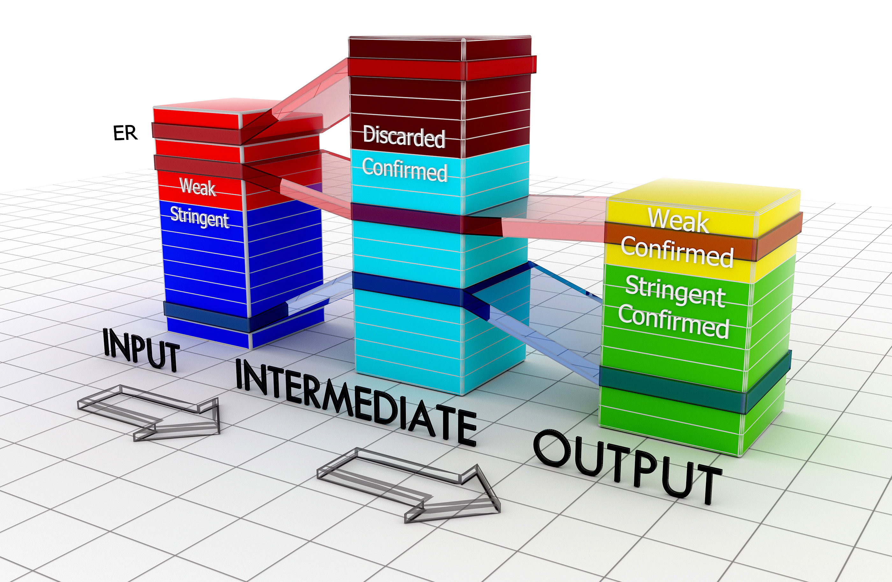

| [Documentation](https://github.com/Genometric/MSPC/wiki) | [Download](https://github.com/Genometric/MSPC/releases) | [Publication](https://academic.oup.com/bioinformatics/article/31/17/2761/183989/Using-combined-evidence-from-replicates-to)
| -- |:--:| --: |
---

## About

The analysis of ChIP-seq samples outputs a number of enriched regions, each indicating a protein-DNA interaction or a specific chromatin modification. Enriched regions (commonly known as "peaks") are called when the read distribution is significantly different from the background and its corresponding significance measure (p-value) is below a user-defined threshold.

When replicate samples are analysed, overlapping enriched regions are expected. This repeated evidence can therefore be used to locally lower the minimum significance required to accept a peak. Here, we propose a method for joint analysis of weak peaks.

Given a set of peaks from (biological or technical) replicates, the method combines the p-values of overlapping enriched regions: users can choose a threshold on the combined significance of overlapping peaks and set a minimum number of replicates where the overlapping peaks should be present. The method allows the "rescue" of weak peaks occuring in more than one replicate and outputs a new set of enriched regions for each replicate. 

For details you may refer to the [MSPC publication](http://bioinformatics.oxfordjournals.org/content/31/17/2761) and  [slides on slideshare](http://www.slideshare.net/jalilivahid/mspc-50694133).

 

## Call Example (see [this page](https://github.com/Genometric/MSPC/wiki) for documentation)

    // on Windows
    MSPC -i rep1.bed -i rep2.bed -i rep3.bed -r biological -s 1E-8 -w 1E-4
    
    //on Linux/Mac
    mono MSPC -i rep1.bed -i rep2.bed -i rep3.bed -r biological -s 1E-8 -w 1E-4

 

## Citing MSPC
If you use or extend MSPC in your published work, please cite the following publication:

    Vahid Jalili, Matteo Matteucci, Marco Masseroli, Marco J. Morelli;
    Using combined evidence from replicates to evaluate ChIP-seq peaks.
    Bioinformatics 2015; 31 (17): 2761-2769. doi: 10.1093/bioinformatics/btv293

## Graphical version
[MuSERA](Musera.codeplex.com) is a graphical tool that efficiently implements MSPC for comparative evaluation of ChIP-seq and DNase-seq samples. Additionally, it facilitates the assessment of replicates by integrating common pipelines such as _functional analysis_, _nearest feature distance distribution_, _chromosome-wide statistics_, _plotting features_, and an _integrated genome browser_.
