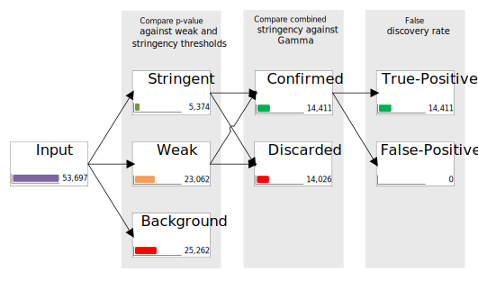

MSPC `CLI` outputs different classifications of peaks (e.g., stringent, weak, stringent-confirmed,
weak-discarded) into merged and separated BED files. An output BED file contains all parsed 
information of a peak (i.e., chr, chromStart, chromEnd, name, and p-value) plus the combined 
significance and corresponding right-tail probability. An example is as follows: 

```shell
# from input:
chr1  32600  32680  MACS_peak_4  4.08

# in the output:
chr1  32600  32680  MACS_peak_4  4.08  222.936  46.373
```

For each sample, the following bed files are created in a folder named as the sample:

| File name      | Description |
| -------------- | ----------- |
| Background     | Peaks with p-value above the weak threshold (i.e., `-w`). | 
| Confirmed      | Stringent confirmed and weak confirmed peaks. |
| Discarded      | Stringent and weak discarded peaks. |
| FalsePositive  | Stringent confirmed and weak confirmed peaks that fail the Benjamini-Hochberg multiple testing correction. |
| Stringent      | Peaks with p-value below the stringency threshold (i.e., `-s`). |
| TruePositive   | Stringent confirmed and weak confirmed peaks, passing the Benjamini-Hochberg multiple testing correction. |
| Weak           | Peaks with p-value above or equal to the stringency threshold (i.e., `-s`) and below the weak threshold (i.e., `-w`). |


